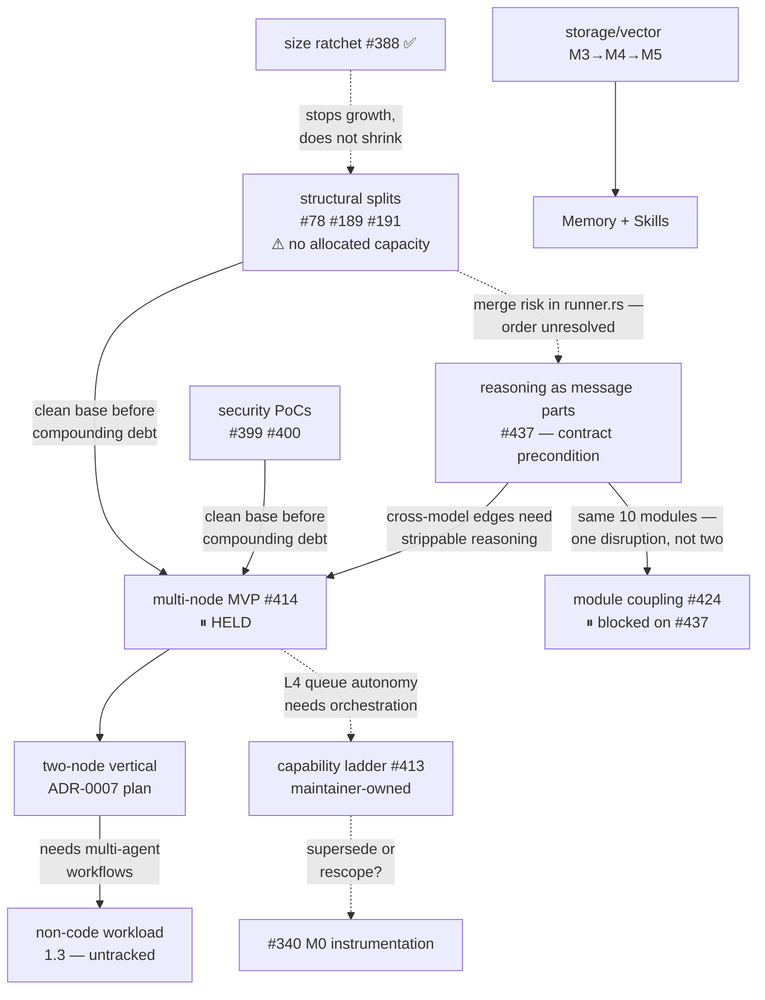

# Status

One screen: what runs today, where we are, what's next. Updated at
milestone boundaries — **last: 2026-07-20** (M0 "close the loop" met).
If this contradicts `git log`, trust the log and fix this file.

## Maturity: pre-alpha

**There are no external users, no published release, and no compatibility
promise of any kind.** Everything below is built on that assumption, and
so is every review of it.

Concretely, and deliberately:

- **Backward compatibility is not a goal.** Wire formats, event payloads,
  config file names and shapes, CLI surfaces, and on-disk layouts change
  without deprecation windows, version negotiation, or migration code. A
  client and a daemon from different builds are not expected to
  interoperate, and a skew failure is a deploy ordering problem, not a bug.
- **Rollback to an earlier build is not supported.** Deploy tooling may
  assume it only ever moves forward. A rollback that fails is a known
  limitation, not a defect to file.
- **Manual intervention on upgrade is acceptable.** Renaming a config,
  re-pairing a client, clearing state, or hand-fixing a host is a fine
  answer. Prefer a clear failure that names the manual step over
  automation that guesses.
- **Delete transition scaffolding once the transition is done.** Code that
  exists only to straddle two versions is a liability here, not an asset —
  it is untested against the version it claims to support and it hides the
  simple path.

The corollary for reviews: **a finding whose only impact is on
compatibility, migration, or rollback is out of scope** — note it and move
on. Findings about the *current* build's correctness are always in scope.

Revisit this section when the first external consumer appears; until then
it is the licence to keep changing shape quickly.

## What runs today

- **Runtime (`fqd`)** — a persistent daemon (event projection +
  trigger dispatcher over NATS/JetStream). Agents are Markdown definitions
  executed through the suspend/resume [reducer harness](docs/guide/reducer-harness.md);
  per-agent model selection, budget enforcement after every LLM call,
  sandboxed built-in tools (`file_read`, `file_write`, `exec`,
  `self_inspect`). Full [MCP client](docs/guide/mcp.md) (spec 2025-11-25):
  stdio + Streamable HTTP transports; tools, resources, prompts, and the
  server-initiated capabilities (sampling, elicitation, roots). Operator
  surface: `fq init / run / trigger / reload / down / agent / invocation`
  (including `transcript`) `/ events / costs / status / workers /
  dead-letters / doctor` (read commands take `--json`), plus the
  authenticated-edge client verbs `fq connect` (TOFU cert pinning +
  token), `fq ops list`, and `fq token attenuate` (offline token
  narrowing), plus a read-only
  web dashboard (`fq-dashboard` over the daemon's localhost tarpc read
  service — the
  [operator-dashboard plan](docs/plans/closed/2026-07-10-operator-dashboard.md)).
- **Store (`fq-cas`)** — [content-addressed storage](services/fq-store/README.md)
  (BLAKE3, FastCDC dedup) + named objects with version history + verified
  online GC + [access control](docs/guide/access-control.md) (event-sourced
  grants with delegation/revocation, biscuit capability tokens, default-deny
  gate). Library + CLI (`put/get/object/gc/grant/token`). `fq-cas serve` is
  localhost-only and unauthenticated until M5.
- **Scheduled triggers (`fq-cron`)** — a standalone durable scheduler
  [adapter](adapters/fq-cron/README.md): reads cron jobs from a hot-reloaded
  TOML file and publishes their payloads to NATS subjects (typically
  `fq.trigger.<agent>` for time-driven agent runs). Durable fire state
  survives restarts in a JetStream KV bucket with a per-job missed-fire
  policy ([design](adapters/fq-cron/DESIGN.md)). Ships as a deployed
  binary in the dogfood bundle.
- **GitHub watcher (`github-watcher`)** — a standalone Go
  [trigger adapter](adapters/github-watcher/README.md): polls a repo for
  issues labelled `ready`, triggers an agent per issue over the
  documented wire contracts, then observes the run's lifecycle events
  and moves the issue's label onward so nothing strands mid-flight. The
  intake side of the M0 change loop; ships in the dogfood bundle.
- **Infra** — NATS via `infrastructure/docker-compose.yml`, bound to localhost
  with the public static development token `fq-dev-token`. Do not expose its
  port, and replace the token for any non-local deployment. Build from source
  (`just up`, see [Quickstart](QUICKSTART.md)); `install.sh` awaits the
  first release.

## Where we are

Phase 1 (the walking skeleton) is
[closed](docs/plans/closed/2026-04-02-phase-1-foundation.md).
[Phase 2](docs/plans/active/2026-04-11-phase-2-mcp-and-memory.md) — MCP,
memory, and skills — is at its midpoint:

| Phase 2 pillar | State |
|---|---|
| 1. MCP client | **Done** |
| 2. Storage + vector foundation | **In progress** — M1 (CAS/index/GC) and M2 (access control) done; M3 (extraction) → M4 (embedding + retrieval) → M5 (service wiring + SDK) remain |
| 3. Memory service | Not started (consumes M4/M5) |
| 4. Skill registry | Not started (consumes M4/M5) |
| 5. Context window management | Not started |
| 6. Agent-definition extensions | `mcp:` done; `skills:` pending |

On the Q ladder, **M0 ("close the loop") is met** as of 2026-07-20: the
autonomous change loop has landed 20+ accepted, `just ci`-validated PRs
against this repo across multiple task types (features, fixes, tests,
docs) — maintainer-confirmed per the done signal of the now-closed
[M0 plan](docs/plans/closed/2026-07-05-m0-close-the-loop.md).

## What's next

M3, then M4, then M5, per the
[storage + vector foundation plan](docs/plans/active/2026-06-27-storage-vector-foundation.md);
Memory and Skills MVPs build on the result. On the runtime side the
[reducer verification plan](docs/plans/closed/2026-07-05-reducer-verification.md)
is **complete** (claims R1–R7 all oracle-backed in the hermetic CI
path: trace oracle, state validation, sim world, resume equivalence,
crash DST, budget properties, soak — seven real bugs found and fixed
by it; `just soak` scales the lifecycle driver for deep local runs).
The registry-first API + daemon/CLI split (ADR-0006 + ADR-0031) is
**underway** per the
[registry-and-split-execution plan](docs/plans/active/2026-07-20-registry-and-split-execution.md):
Phase 0 (golden net), Phase 1 (`fq-ops` contract crate), and Phase 2
(the authenticated generic edge — `fq-edge`, TLS + capability tokens —
wired into the daemon and enabled by default) have landed. Phase 3, the
exemplar slices proving one declaration per category through the edge,
is **complete** as of 2026-07-28: watermark plumbing (3a) and typed op
identifiers are in, the `Invocation` view (3b) has flipped its CLI verbs
behind golden, `invocation.drop` (3c) composes read-your-writes through
the public surface alone, and the `Turn` atom (3d) added
`turn.get`/`turn.list`/`turn.stream` with `--follow` riding the stream.
Phase 3e closed decision D-3 with **no codegen**: shared data
definitions in one workspace are the interface, so ADR-0006's held
per-method-generation fallback is formally not taken. Phase 4, the fleet
migration, is **underway**: cohort 4.0 (the pure flips over ops that
already existed) landed 2026-07-28 — `fq invocation drop` (verb 18) and
`fq invocation transcript` (verb 20) now speak only the edge — leaving
**15 verb flips**, surveyed call point by call point in the
[Phase-4 call-point inventory](docs/plans/active/2026-07-28-phase-4-call-point-inventory.md).
A migration gate counts the operator surface's remaining legacy call
points (10 at Phase-4 start, 8 now, zero at the end) so a flip cannot
leave the old path behind as a fallback.
The dogfood loop **lands PRs**: the daily `doc-drift` agent
(fq-cron-scheduled) now opens its own docs-only PRs for drift it can
verify and fix, and files issues for the rest; alongside it the
`github-watcher` adapter triggers
an `m0-issue-fix` agent on `ready`-labelled issues (agent definitions in
`~/fq-dogfood`, outside the repo); the agent makes the change in a
sandboxed working copy, validates with `just ci`, and opens a PR behind
the human merge gate — the loop that met M0 (see the closed
[M0 plan](docs/plans/closed/2026-07-05-m0-close-the-loop.md)). Next on
that track: exactly-once trigger dispatch
([plan](docs/plans/active/2026-07-18-exactly-once-trigger-dispatch.md))
to close the duplicate-PR redelivery storm, and the M0 plan's proxy
instrumentation (read relative to an expert+frontier baseline) to make
**M1 (Q1)** decidable. Open strategic questions
(security sequencing) are in the
[2026-07-05 project assessment](docs/reviews/2026-07-05-project-assessment.md).

## How the work is sequenced

A coarse map of what gates what. It exists because a hold is
indistinguishable from neglect unless the reason is written down: the
graph-executor plan sat untouched for three weeks and read as
abandoned, when it was deliberately waiting on security and structural
work. Workstream-level only — per-issue dependency trees come from
`issue-graph` against GitHub sub-issue links, not from this diagram.
**Rule: anything held carries a named exit condition.**

Reading the diagram: solid arrows are hard gates; dashed arrows are
open questions or weak couplings. Of the exit criteria drawn into #414,
five (#399, #400, #78, #189, #191) are **proposed and not yet confirmed
by the maintainer** — read them as a candidate release condition for
the hold, not a settled one. #437 is different: it was **confirmed by
the maintainer on 2026-07-28** and is a contract precondition rather
than debt-avoidance. Reasoning blocks are tied to the model that
produced them, and ADR-0003 guarantees per-agent model selection, so a
multi-node graph has cross-model edges by construction; on each of
those, reasoning must be stripped. That invariant belongs to the graph,
not to an invocation, and cannot be expressed while `Message` is
`{role, content: Option<String>, tool_calls, tool_call_id}` and
reasoning has no name in the type system. Only the message shape
carries the gate — the provider work in #437 is separable.

#437 also blocks #424: `events` is the highest fan-in module in the
tree at 10, and the parts change ripples through the same ten modules
that epic restructures, so the coupling work waits rather than
measuring against a graph about to change shape. Its advisory
`just lint-coupling` phase keeps running meanwhile.

One ordering is deliberately left open (drawn dashed): whether #437
lands before or after #78/#189/#191. Both touch `runner.rs`, so
whichever goes second pays a merge cost — but #78/#189/#191 carry no
allocated capacity today, and #437 should not inherit that stall. The
size ratchet (#388) stops those files growing but does not shrink them.
The non-code workload (cleanroom finding 1.3) has no issue yet.
Registry + split execution (ADR-0006/0031) and exactly-once trigger
dispatch are in flight but gate nothing on this map, so they are
omitted rather than drawn as orphans.

## Not built yet

Multi-agent orchestration (ADR-0007, accepted but unbuilt) ·
memory + skills services · context compaction · container isolation
(ADR-0010, accepted but unbuilt) · observability floor
(JSON logs, metrics, alerting) · production-grade NATS credentials and
rotation · tagged binary releases (the
rolling `main-latest` deploy channel is built — see
[ops/dogfood](ops/dogfood/README.md) — but no `v*` release has shipped).

## Pointers

[Quickstart](QUICKSTART.md) · [Architecture](ARCHITECTURE.md) ·
[Vision](VISION.md) · [Active plans](docs/plans/active/) ·
[Issues](https://github.com/bricef/factor-q/issues) · [ADRs](docs/adrs/) ·
[Guides](docs/guide/)
